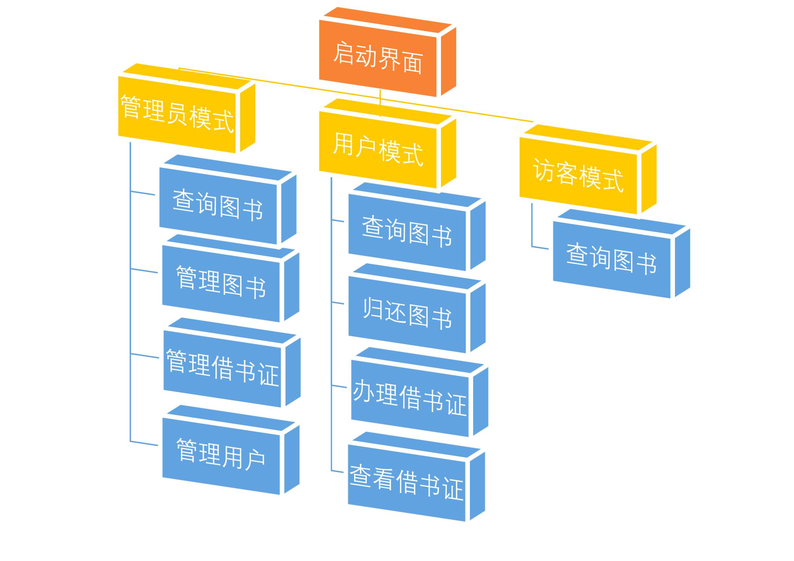

# 图书管理系统

## 一、实验目的
### 1、设计并实现一个精简的图书管理系统，具有注册、登录、查询、借阅、归还、办理借书证、管理图书等基本功能。
### 2、通过本次设计来加深对数据库的了解和使用，同时提高自身的系统编程能力。
### 3、掌握数据库应用开发程序设计方法。

## 二、实验平台
开发工具：eclipse；数据库平台：Mysql。

## 三、实验概述

### 1、图书管理系统设计
启动界面可以选择使用模式，包括管理员模式、用户模式和访客模式，不同
模式的权限不同，其中未登录的访客模式只能查询书籍。以上为主要模块的关系，
各个界面的功能介绍如下：

|界面名称|界面功能|
|---|---|
启动界面|	在此界面选择管理员模式、用户模式和访客模式。
管理员登录界面|	在此界面输入管理员用户名与密码进入管理员主界面。
管理员主界面|	在此界面选择想要使用的功能：查询图书，管理图书，管理借书证，管理用户。
查询图书（管理员模式）界面|	在此界面进行图书查询、修改、删除图书。
管理图书界面	|在此界面添加、修改图书。
管理借书证界面	|在此界面管理借书证，可一键归还全部书籍与注销借书证。
管理用户界面|	在此界面对用户进行注销。
用户登录界面	|在此界面进行登录或注册。
用户主界面	|在此界面选择想要使用的功能：查询图书，归还图书，办理借书证，查看借书证。
查询图书（用户模式）界面	|在此界面进行查询、借阅图书，每张借书证限借出10本。
归还图书界面	|在此界面归还图书。
办理借书证界面	|在此界面办理借书证，每位用户限办理5张。
查看借书证界面|	在此界面查看自己的借书证以及每张借书证下借的书。
查询界面（访客模式）|	在此界面查询书籍，但不可借出。
### 2、数据库设计
总共设计了5张表：user, auser, book, card, record。具体内容如下：
#### （1）user
|字段名	|类型	|性质/限制	|说明
|---|---|---|---|
id	|int|	主码，自增|	用户的id，用于辨别身份
password|	Varchar(45)|	长度不超过12字符	|登录密码
username|	Varchar(45)	|唯一，长度不超过20字符	|用户名
#### （2）auser
|字段名	|类型|	性质/限制|	说明|
|---|---|---|---|
id	|int	|主码，自增	|管理员的id，用于辨别身份
password	|Varchar(45)|	长度不超过12字符	|登录密码
username	|Varchar(45)	|唯一，长度不超过20字符	|管理员用户名
#### （3）book
|字段名	|类型	|性质/限制	|说明|
|---|---|---|---|
no	|VARCHAR(45)	|主码，唯一|	书号
name	|VARCHAR(45)	|非空	|书名
author	|VARCHAR(45)	|默认“佚名”|	作者
type	|VARCHAR(45)	|默认“未知”	|图书类型
publisher	|VARCHAR(45)	|默认“未知”	|出版社
storage	|VARCHAR(45)	|大于等于0|	库存量
#### （4）card
字段名|	类型	|性质/限制|	说明
|---|---|---|---
cardNo	|int	|主码，自增	|卡号
amount	|int|	0到5	|当前借书量
username	|Varchar(45)|	外码，参照user|	用户名
#### （5）record
字段名	|类型	|性质/限制|	说明
|---|---|---|---|
rid	|int	|主码，自增|	借书记录的编号
cardNp|	int	|外码参照card|	卡号
no	|Varchar(45)	|外码参照book|	书号
### 3、实验工具介绍
本图书管理系统采用的设计平台是eclipse,该平台提供了gui设计插件swing，支持基本的代码补全功能，可以方便地编辑与调试图形界面。选用的语言是java，因为eclipse对java的适配度最高。使用的数据库系统是Mysql，可以使用图形交互进行数据库表的管理。使用的JDBC库为mysql-connector-java-8.0.27，能够进行与Mysql数据库的连接、SQL语句的编辑与执行等功能。使用的icon图标来自网站 <https://www.iconfinder.com/>。
## 四、实验详细设计
详见见代码部分。
